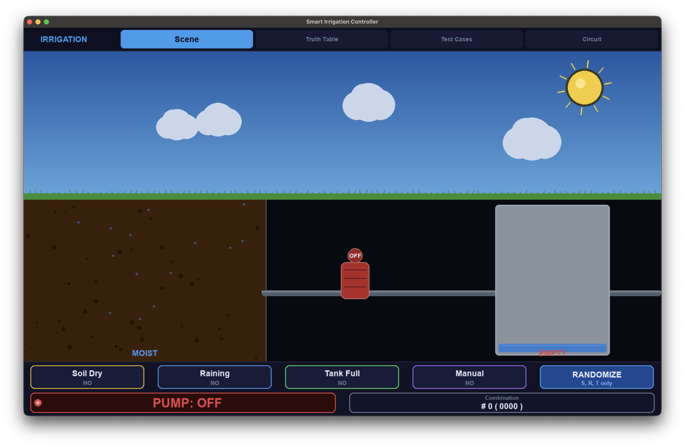
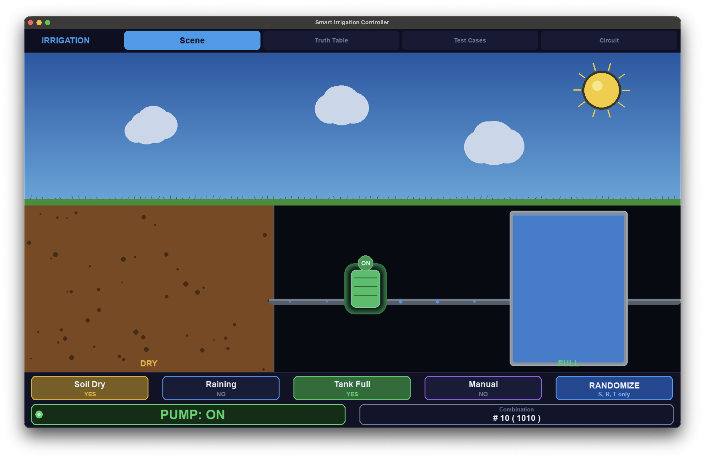
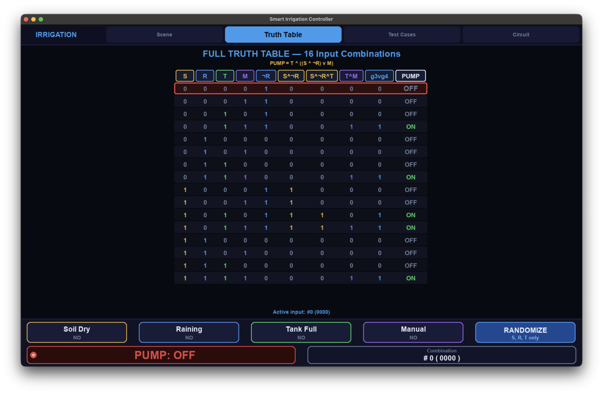
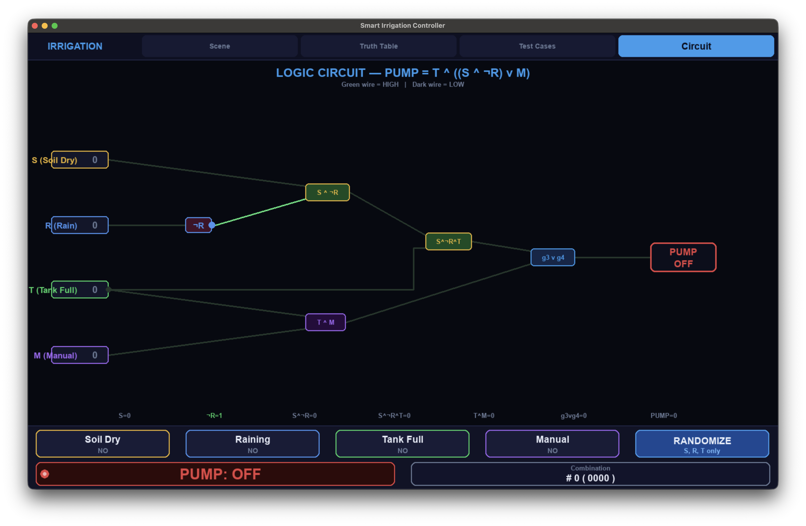
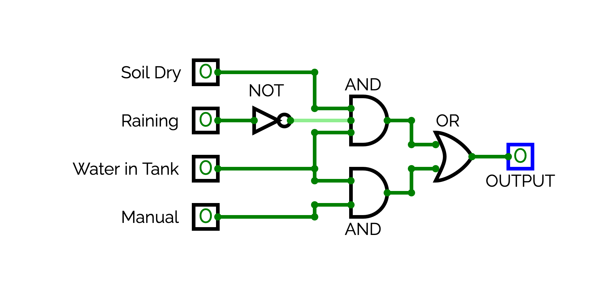

# 💧 Smart Irrigation Controller


---

## 👥 Group Members

| Name |
|------|
| *Xaydarov Timur* |
| *Abdulaziz Xolamamatov* |
| *Adham Abdiyev* |
| *Dawit baxhramov* |
| *Abdukarim Xudayberdiyev* |

---

## 📚 Course & Instructor

- **Course:** Digital Design Fundamentals (EEE120001)
- **Instructor:** *Rajan Tripathi*
- **Project:** Project 6 — Smart Irrigation Controller

---

## 🌱 Problem Statement

Agriculture wastes enormous amounts of water through inefficient irrigation. This project designs a **Smart Irrigation Controller** — a system that automatically decides whether a water pump should turn ON or OFF based on real-world environmental conditions.

The system prevents unnecessary watering when the ground is already moist or when rain is detected, and includes a manual override for direct human control. The logic was implemented both as a **digital circuit** (CircuitVerse) and as an **interactive Python simulation** (Pygame).

---

## 📥 Inputs

| Signal | Label | Description |
|--------|-------|-------------|
| S | Soil Dry | Is the soil moisture below the irrigation threshold? |
| R | Rain Detected | Is precipitation currently being detected? |
| T | Tank Has Water | Is the water reservoir sufficiently full? |
| M | Manual Override | Force the pump ON regardless of sensor readings |

---

## 📤 Output

| Signal | Label | Description |
|--------|-------|-------------|
| PUMP | Pump ON/OFF | Activates the water pump when conditions are met |

---

## ⚙️ Digital Logic Explanation

### Boolean Expression

```
PUMP = T ∧ ((S ∧ ¬R) ∨ M)
```

### Gate-by-Gate Breakdown

| Gate | Expression | Type | Description |
|------|-----------|------|-------------|
| g1 | ¬R | NOT | Inverts rain signal — true when no rain |
| g2 | S ∧ ¬R | AND | Soil is dry AND no rain detected |
| g3 | g2 ∧ T | AND | Above condition AND tank has water |
| g4 | T ∧ M | AND | Manual override AND tank has water |
| g5 | g3 ∨ g4 | OR | Either automatic or manual condition satisfied |
| PUMP | g5 | OUT | Final pump output |

### Logic Summary

The pump turns **ON** when:
- The soil is **dry**, there is **no rain**, and the **tank has water** — automatic mode
- The **manual override** is active AND the **tank has water** — manual mode

The tank requirement (`T`) acts as a **safety gate** in both paths — the pump can never activate with an empty tank, even under manual override.

### Sequential Component

The circuit includes a **D Flip-Flop (memory bit)** connected to the NOT M output, providing state memory and demonstrating sequential logic alongside the combinational gates.

---

## 🔌 CircuitVerse Link

**[▶ Open Circuit in CircuitVerse](https://circuitverse.org/simulator/embed/irrigation-3bcea4a5-e74c-4c98-90e3-df958e638341)**

The circuit includes:
- 4 labeled inputs (S, R, T, M)
- NOT, AND, OR gates wired to match the Boolean expression
- D Flip-Flop for sequential memory (NOT M output)
- 2 labeled outputs: PUMP and ¬M

---

## 🐍 Python Program Explanation

The simulation is built with **Pygame** and runs fullscreen. It has four tabs:

### 🌱 Scene Tab
An animated farm scene that reacts to inputs in real time:
- **Sky** — gradient with animated sun (hidden when raining)
- **Clouds** — drift across the sky, turn grey during rain
- **Rain** — 140 animated droplets when R = ON
- **Soil** — changes colour from warm brown (dry) to dark earth (moist), with moisture particle effects
- **Pump** — glows green with pulsing halo when ON, flat red when OFF
- **Water tank** — fills and drains smoothly with animated water shimmer
- **Pipe** — shows animated water particles flowing when pump is running

### 📊 Truth Table Tab
All 16 input combinations displayed with every intermediate gate signal. The currently active input combination is highlighted in real time as you toggle inputs.

### 🧪 Test Cases Tab
10 predefined test scenarios with PASS/FAIL verification and a live score. The row matching the current inputs is highlighted automatically.

### 🔌 Circuit Tab
A live logic diagram showing all gates and wires. Wires turn green (HIGH) or dark (LOW) as you change inputs, mirroring the CircuitVerse design.

### Controls
| Action | Result |
|--------|--------|
| Click **Soil Dry / Raining / Tank Full** | Toggle that input |
| Click **Manual** | Enables manual mode — set S/R/T yourself |
| Click **RANDOMIZE** | Randomizes S, R, T (only active when Manual = OFF) |
| **Escape** | Exit program |
| **F12** | Save screenshot to file |

---

## 🤖 How AI / LLM Was Used

### Code Generation
The core logic and program structure were written by our team. AI helped build the interactive game simulation based on our specific requirements and Boolean expression, generating clean conditional statements aligned with our circuit design.

### Logic Design Assistance
AI helped verify gate configurations and simplify the Boolean expression, catching redundant logic before circuit implementation.

### Test Case Generation
Slide design was AI-generated; all test scenarios, edge cases, and safety conditions were defined and validated by our team.

> **All AI-generated content was reviewed, validated, and adapted by the team to meet project specifications.**

---

## ▶️ How to Run the Python Code

### Requirements

```bash
pip install pygame
```

Python 3.8 or higher required.

### Run

```bash
python main.py
```

The program launches in **fullscreen** automatically.  
Press **Escape** to exit fullscreen.  

### File Structure

```
├── main.py          # Main program — run this
└── README.md        # This file
```

---

## 📸 Screenshots

### Scene — Pump OFF (all inputs 0)


### Scene — Pump ON (S=1, R=0, T=1)


### Truth Table — Input #10 highlighted (1010)


### Circuit — Live gate diagram


### CircuitVerse Design


### Demonstration


---

## 🔮 Future Improvements

- **Real sensor integration** — connect to actual soil moisture and rain sensors via GPIO (Raspberry Pi)
- **Data logging** — record pump activation history with timestamps to a CSV file
- **Scheduling** — add time-based rules (e.g., water only at dawn/dusk)
- **Multi-zone support** — extend the logic to handle multiple irrigation zones with separate pumps
- **Mobile dashboard** — web-based interface accessible from a phone
- **Water usage tracker** — estimate and display litres consumed per session
- **Weather API** — pull real-time rain forecast to predictively prevent unnecessary watering

---

## 🌍 Practical Relevance

Smart irrigation directly addresses one of agriculture's biggest challenges — **water waste**. Systems like this are used in:
- Large-scale farming operations
- Home garden automation
- Greenhouse management
- Smart city green infrastructure

By combining digital logic design with an interactive simulation, this project bridges theory and real-world application.

---

*Project 6 — Digital Design Course*
